# 🗺️ Google Maps MCP Server for Archestra

## 🚀 The Story: One Click, Infinite Possibilities

Imagine this: You're planning a weekend getaway. Instead of juggling between Google Maps, multiple apps, and your memory, you simply ask:

> *"Show me romantic restaurants near the beach I visited last summer, but only the ones I rated highly"*

**One click. One question. Your entire Google Maps universe at your fingertips.**

This isn't just another integration—it's a **revolutionary way to interact with your location data** through Archestra's powerful agent ecosystem. We're not just connecting to Google Maps; we're creating an **intelligent memory system** that understands your preferences, learns from your patterns, and answers complex questions through a **chain of specialized AI agents**.

### Why This is Different

Traditional integrations give you data. **We give you intelligence.**

- 🧠 **AI-Powered Memory**: Your places aren't just stored—they're understood, analyzed, and contextualized
- 🔗 **Agent Orchestration**: Complex queries are broken down and answered by specialized sub-agents working in harmony
- 🎯 **Mood-Based Intelligence**: Get recommendations that match not just your location, but your current mood and context
- 📊 **Deep Insights**: Understand patterns you never knew existed in your travel and place preferences
- ⚡ **One-Click Access**: Deploy once, use forever—Archestra handles the complexity

---

## 🏗️ System Architecture

### High-Level Overview

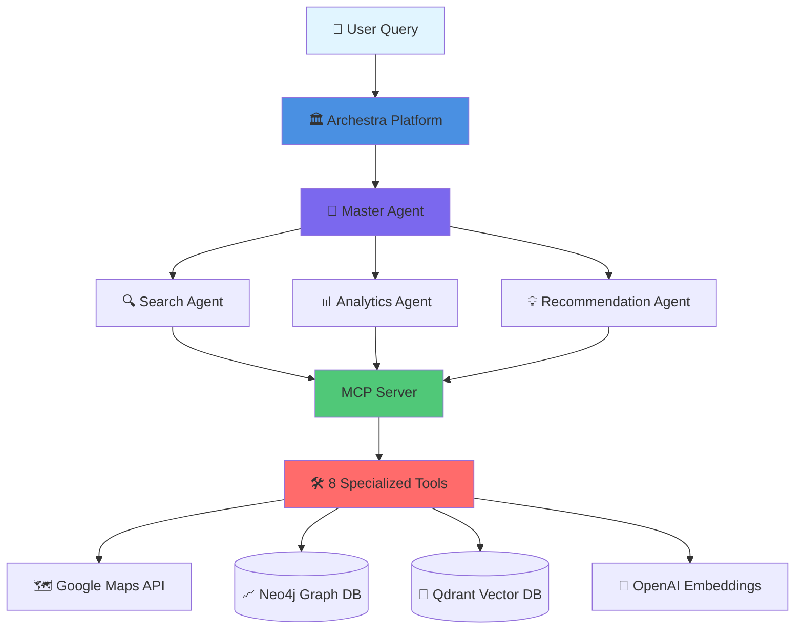

### Complete Deployment Flow

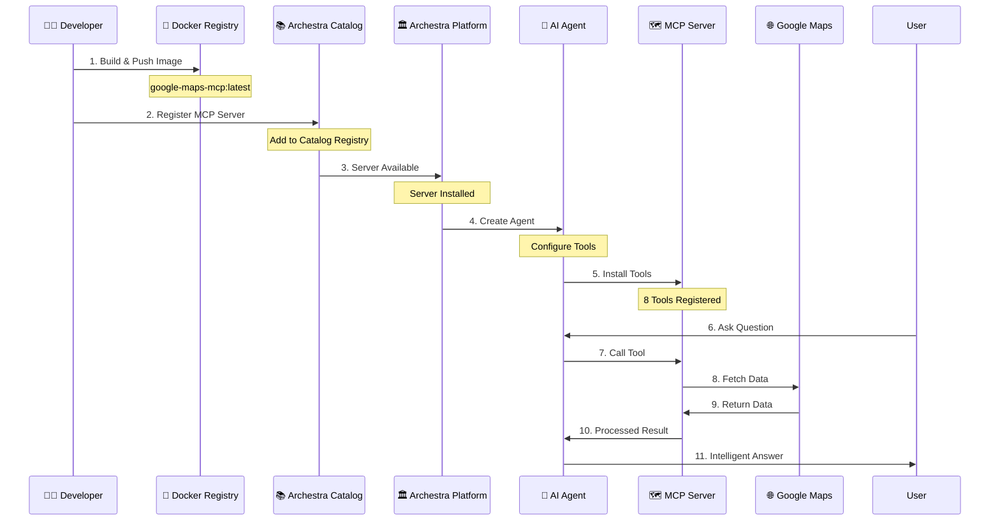

### Agent Chain Architecture

```mermaid
graph LR
    Query[User Query:<br/>"Romantic beach<br/>restaurants I loved"] --> Router{Query Router}
    
    Router -->|Search| SearchAgent[🔍 Search Agent]
    Router -->|Analyze| AnalyticsAgent[📊 Analytics Agent]
    Router -->|Recommend| RecAgent[💡 Recommendation Agent]
    
    SearchAgent --> Tool1[get_saved_places]
    SearchAgent --> Tool2[search_saved_places]
    
    AnalyticsAgent --> Tool3[analyze_preferences]
    AnalyticsAgent --> Tool4[get_insights]
    AnalyticsAgent --> Tool5[get_places_by_sentiment]
    
    RecAgent --> Tool6[get_recommendations]
    RecAgent --> Tool7[get_place_details]
    RecAgent --> Tool8[get_place_activity]
    
    Tool1 --> MCP[MCP Server]
    Tool2 --> MCP
    Tool3 --> MCP
    Tool4 --> MCP
    Tool5 --> MCP
    Tool6 --> MCP
    Tool7 --> MCP
    Tool8 --> MCP
    
    MCP --> Aggregator[Result Aggregator]
    Aggregator --> Response[Intelligent Response]
    
    style Query fill:#e1f5ff
    style Router fill:#4a90e2
    style SearchAgent fill:#7b68ee
    style AnalyticsAgent fill:#7b68ee
    style RecAgent fill:#7b68ee
    style MCP fill:#50c878
    style Response fill:#ff6b6b
```

### Tool Execution Flow

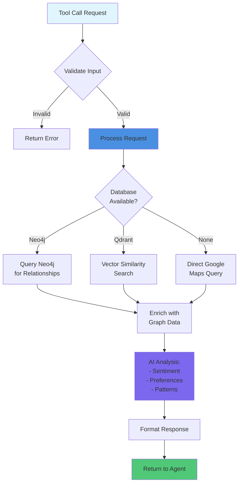

---

## 📦 Installation & Setup

### Step 1: Build the MCP Server

```bash
# Clone the repository
git clone https://github.com/Sushant6095/maps-mcp-archestra.git
cd maps-mcp-archestra

# Build Docker image
docker build -t your-registry/google-maps-mcp:latest .

# Push to registry
docker push your-registry/google-maps-mcp:latest
```

### Step 2: Register in Archestra Catalog

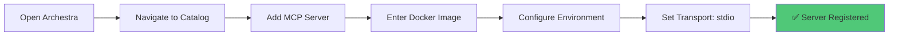

**In Archestra UI:**
1. Navigate to `http://127.0.0.1:3000/mcp-catalog/registry`
2. Click "Add New MCP Server"
3. Provide Docker image: `your-registry/google-maps-mcp:latest`
4. Configure environment variables (see below)
5. Set transport type to `stdio`

### Step 3: Install Tools in Your Agent

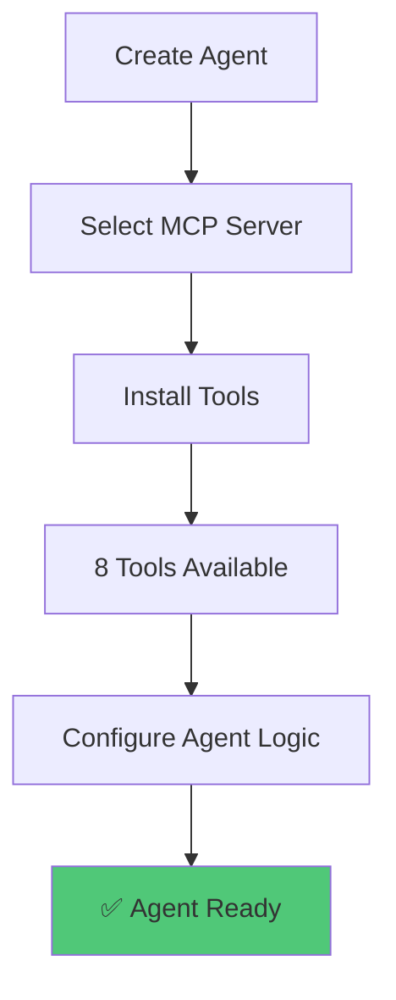

### Step 4: Create Agent Chain

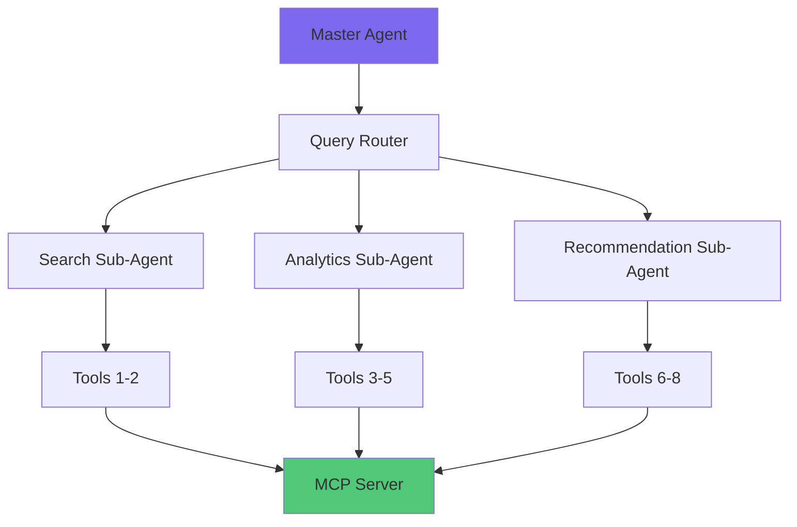

---

## 🛠️ The 8 Powerful Tools

### Tool Categories

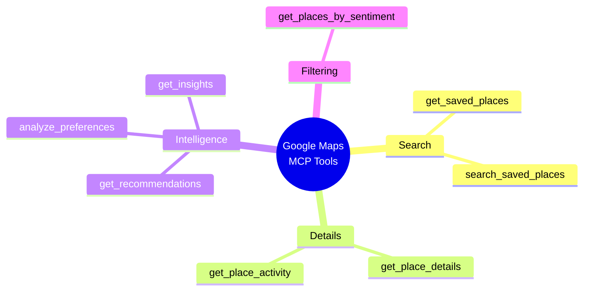

### 1. `get_saved_places` - Foundation Tool
Retrieve saved places with intelligent filtering.

**Use Case**: "Show me all my saved restaurants in San Francisco"

### 2. `search_saved_places` - Fuzzy Search
Search across names, addresses, tags, and notes.

**Use Case**: "Find that Italian place I saved last year"

### 3. `get_place_details` - Deep Dive
Comprehensive place information with activity history.

**Use Case**: "Tell me everything about that beach I visited"

### 4. `get_place_activity` - History Analysis
Visit history, reviews, photos, and insights.

**Use Case**: "When did I last visit this place and what did I think?"

### 5. `get_recommendations` - Mood-Based AI
Intelligent recommendations based on mood and context.

**Use Case**: "I'm feeling adventurous, what should I explore?"

### 6. `analyze_preferences` - Pattern Discovery
Deep analysis of preferences, patterns, and trends.

**Use Case**: "What are my travel patterns and preferences?"

### 7. `get_places_by_sentiment` - Emotional Filter
Filter places by sentiment (positive, negative, neutral).

**Use Case**: "Show me only places I loved"

### 8. `get_insights` - Comprehensive Intelligence
Complete insights including trends, favorites, and discoveries.

**Use Case**: "Give me a complete overview of my places"

---

## 🔄 Agent Chain Example

### Query: "Show me romantic restaurants near beaches I've visited, but only ones I rated 4+ stars"

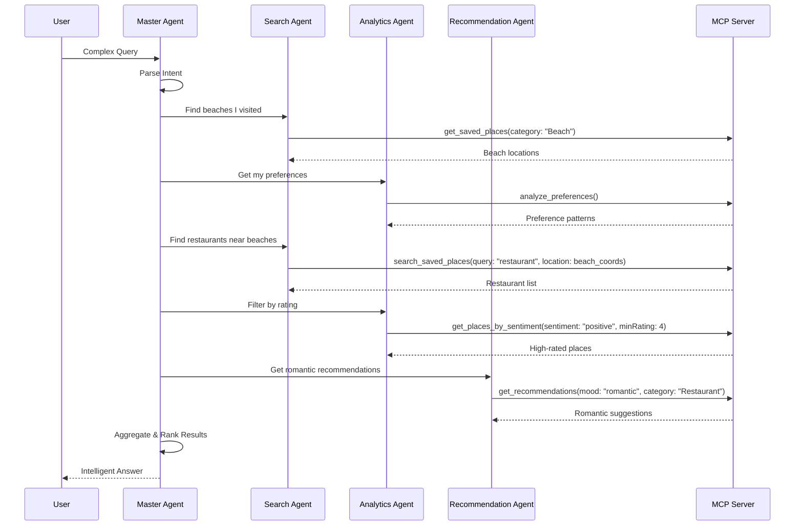

---

## ⚙️ Environment Variables

```bash
# Required
GOOGLE_CLIENT_ID=your_client_id
GOOGLE_CLIENT_SECRET=your_client_secret
GOOGLE_REDIRECT_URI=your_redirect_uri
GOOGLE_TOKEN_PATH=./token.json

# Optional but Recommended
GOOGLE_MAPS_API_KEY=your_api_key

# Optional: Enhanced Features
NEO4J_URI=bolt://localhost:7687
NEO4J_USER=neo4j
NEO4J_PASSWORD=password
QDRANT_URL=http://localhost:6333
QDRANT_API_KEY=your_qdrant_key
OPENAI_API_KEY=your_openai_key
```

---

## 🎯 Use Cases & Examples

### Use Case 1: Travel Planning Agent

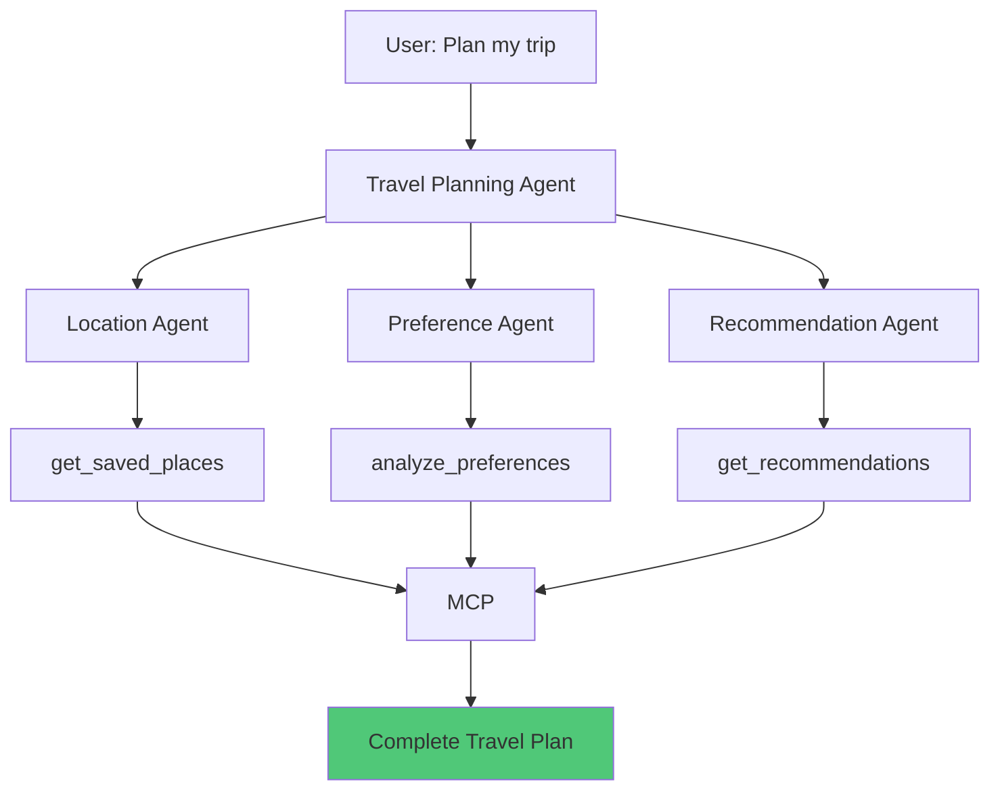

### Use Case 2: Personal Assistant Agent

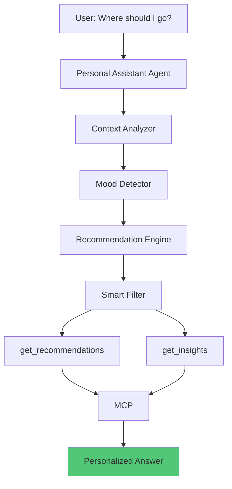

---

## 🚨 Important Notes

### ⚠️ Current Status: Using Mock Data

**Important:** This server currently uses **mock/hardcoded data** for demonstration.

### ⚠️ Critical: Google Maps API Key Limitations

**Just providing a Google Maps API key is NOT enough to get your saved places.**

- ❌ Google doesn't have a "Saved Places" API
- ✅ API key can search places and get details (public data)
- ✅ To get YOUR saved places: Use Google Takeout export + Places API

**Recommended approach:** Google Takeout export + Places API integration.

---

## 📊 Data Flow Architecture

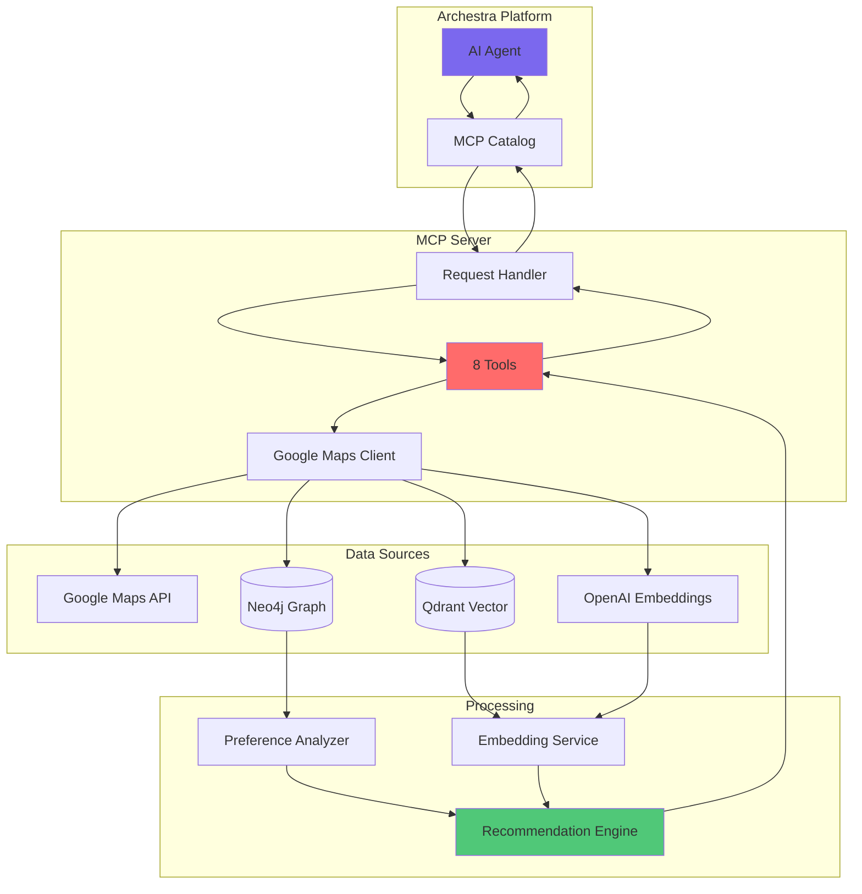

---

## 🔧 Development

### Project Structure

```
.
├── src/
│   ├── server.ts              # Main MCP server
│   ├── types.ts               # TypeScript interfaces
│   ├── google-maps-client.ts  # Google Maps API client
│   ├── preference-analyzer.ts # Preference analysis logic
│   ├── recommendation-engine.ts # Recommendation engine
│   ├── embedding-service.ts   # Embedding service
│   ├── neo4j-client.ts        # Neo4j integration
│   └── qdrant-client.ts       # Qdrant integration
├── dist/                      # Compiled JavaScript
├── package.json
├── tsconfig.json
├── Dockerfile
└── README.md
```

### Scripts

```bash
npm run build      # Compile TypeScript
npm run dev        # Watch mode
npm start          # Run server
npm test           # Test server
```

---

## 🎓 How It Works: The Complete Picture

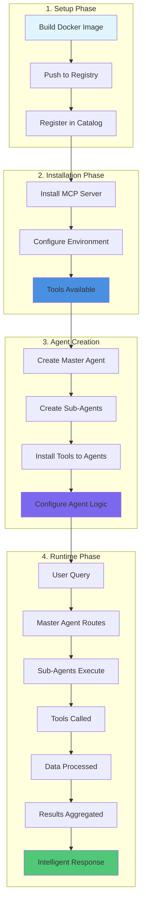

---

## 🌟 Why Archestra + This MCP Server = Game Changer

1. **🔗 Seamless Integration**: One-click deployment, zero configuration complexity
2. **🤖 Agent Orchestration**: Build complex agent chains that work together
3. **📈 Scalability**: Handle thousands of queries with intelligent caching
4. **🧠 AI-Powered**: Not just data retrieval, but intelligent understanding
5. **🔄 Extensibility**: Easy to add new tools and capabilities
6. **📊 Analytics**: Built-in insights and pattern recognition
7. **🎯 Personalization**: Understands your preferences and adapts

---

## 📝 License

MIT

---

## 🤝 Contributing

Contributions welcome! This is a revolutionary approach to location intelligence, and we'd love your input.

---

**Built with ❤️ for the Archestra ecosystem**

*One click. Infinite possibilities. Your entire Google Maps universe, intelligently accessible.*
